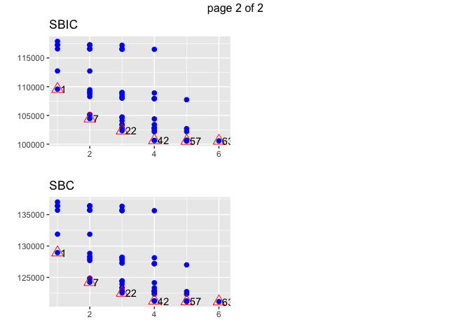

ayudantia 9
================

Cargamos y ordenamos los datos para la primera regresion lineal.

``` r
library(pROC)
```

    ## Type 'citation("pROC")' for a citation.

    ## 
    ## Attaching package: 'pROC'

    ## The following objects are masked from 'package:stats':
    ## 
    ##     cov, smooth, var

``` r
library(regclass)
```

    ## Loading required package: bestglm

    ## Loading required package: leaps

    ## Loading required package: VGAM

    ## Loading required package: stats4

    ## Loading required package: splines

    ## Loading required package: rpart

    ## Loading required package: randomForest

    ## randomForest 4.6-14

    ## Type rfNews() to see new features/changes/bug fixes.

    ## Important regclass change from 1.3:
    ## All functions that had a . in the name now have an _
    ## all.correlations -> all_correlations, cor.demo -> cor_demo, etc.

``` r
library(rsample)
library(readxl)
library(tidyverse)
```

    ## ── Attaching packages ─────────────────────────────────────── tidyverse 1.3.0 ──

    ## ✓ ggplot2 3.3.3     ✓ purrr   0.3.4
    ## ✓ tibble  3.1.0     ✓ dplyr   1.0.5
    ## ✓ tidyr   1.1.3     ✓ stringr 1.4.0
    ## ✓ readr   1.4.0     ✓ forcats 0.5.1

    ## ── Conflicts ────────────────────────────────────────── tidyverse_conflicts() ──
    ## x dplyr::combine()  masks randomForest::combine()
    ## x tidyr::fill()     masks VGAM::fill()
    ## x dplyr::filter()   masks stats::filter()
    ## x dplyr::lag()      masks stats::lag()
    ## x ggplot2::margin() masks randomForest::margin()

``` r
library(ggplot2)
library(dplyr)
library(VIF)
library(GGally)
```

    ## Registered S3 method overwritten by 'GGally':
    ##   method from   
    ##   +.gg   ggplot2

``` r
getwd()
```

    ## [1] "/Users/gabrielengel/Documents/GitHub/Ayudantia-9"

``` r
toyota <- read.csv("/Users/gabrielengel/Downloads/Ayudantia_DataMining01_2021-main/Ayudantia 9/toyota.csv")

vinos <- read.csv("/Users/gabrielengel/Downloads/Ayudantia_DataMining01_2021-main/Ayudantia 9/winequality-red.csv")

summary(toyota)
```

    ##     model                year          price       transmission      
    ##  Length:6738        Min.   :1998   Min.   :  850   Length:6738       
    ##  Class :character   1st Qu.:2016   1st Qu.: 8290   Class :character  
    ##  Mode  :character   Median :2017   Median :10795   Mode  :character  
    ##                     Mean   :2017   Mean   :12522                     
    ##                     3rd Qu.:2018   3rd Qu.:14995                     
    ##                     Max.   :2020   Max.   :59995                     
    ##     mileage         fuelType              tax             mpg        
    ##  Min.   :     2   Length:6738        Min.   :  0.0   Min.   :  2.80  
    ##  1st Qu.:  9446   Class :character   1st Qu.:  0.0   1st Qu.: 55.40  
    ##  Median : 18513   Mode  :character   Median :135.0   Median : 62.80  
    ##  Mean   : 22857                      Mean   : 94.7   Mean   : 63.04  
    ##  3rd Qu.: 31064                      3rd Qu.:145.0   3rd Qu.: 69.00  
    ##  Max.   :174419                      Max.   :565.0   Max.   :235.00  
    ##    engineSize   
    ##  Min.   :0.000  
    ##  1st Qu.:1.000  
    ##  Median :1.500  
    ##  Mean   :1.471  
    ##  3rd Qu.:1.800  
    ##  Max.   :4.500

``` r
toyota %>% head()
```

    ##   model year price transmission mileage fuelType tax  mpg engineSize
    ## 1  GT86 2016 16000       Manual   24089   Petrol 265 36.2          2
    ## 2  GT86 2017 15995       Manual   18615   Petrol 145 36.2          2
    ## 3  GT86 2015 13998       Manual   27469   Petrol 265 36.2          2
    ## 4  GT86 2017 18998       Manual   14736   Petrol 150 36.2          2
    ## 5  GT86 2017 17498       Manual   36284   Petrol 145 36.2          2
    ## 6  GT86 2017 15998       Manual   26919   Petrol 260 36.2          2

``` r
toyota$model <- as.factor(toyota$model)
toyota$transmission <- as.factor(toyota$transmission)
toyota$fuelType <- as.factor(toyota$fuelType)

summary(toyota)
```

    ##       model           year          price          transmission 
    ##   Yaris  :2122   Min.   :1998   Min.   :  850   Automatic:2657  
    ##   Aygo   :1961   1st Qu.:2016   1st Qu.: 8290   Manual   :3826  
    ##   Auris  : 712   Median :2017   Median :10795   Other    :   1  
    ##   C-HR   : 479   Mean   :2017   Mean   :12522   Semi-Auto: 254  
    ##   RAV4   : 473   3rd Qu.:2018   3rd Qu.:14995                   
    ##   Corolla: 267   Max.   :2020   Max.   :59995                   
    ##  (Other) : 724                                                  
    ##     mileage         fuelType         tax             mpg        
    ##  Min.   :     2   Diesel: 503   Min.   :  0.0   Min.   :  2.80  
    ##  1st Qu.:  9446   Hybrid:2043   1st Qu.:  0.0   1st Qu.: 55.40  
    ##  Median : 18513   Other : 105   Median :135.0   Median : 62.80  
    ##  Mean   : 22857   Petrol:4087   Mean   : 94.7   Mean   : 63.04  
    ##  3rd Qu.: 31064                 3rd Qu.:145.0   3rd Qu.: 69.00  
    ##  Max.   :174419                 Max.   :565.0   Max.   :235.00  
    ##                                                                 
    ##    engineSize   
    ##  Min.   :0.000  
    ##  1st Qu.:1.000  
    ##  Median :1.500  
    ##  Mean   :1.471  
    ##  3rd Qu.:1.800  
    ##  Max.   :4.500  
    ## 

``` r
toyota %>% filter(engineSize == 0) %>% nrow()
```

    ## [1] 6

``` r
toyota <- toyota %>%  filter(engineSize != 0)

toyota %>% filter(tax == 0) %>% nrow()
```

    ## [1] 1788

``` r
sum(is.na(toyota))
```

    ## [1] 0

``` r
sum(is.null(toyota))
```

    ## [1] 0

Hacemos la regresion lineal para el precio

``` r
toyota %>% select(year, mileage, tax, mpg, engineSize, price) %>% 
  ggpairs(lower = list(continuous = wrap("points", alpha = 0.3, size = 0.5)))
```

<!-- -->

``` r
toyota %>% 
  ggplot(aes(transmission, price)) +
  geom_boxplot()
```

<!-- -->

``` r
toyota %>% 
  ggplot(aes(fuelType, price)) +
  geom_boxplot()
```

<!-- -->

``` r
toyota %>% mutate(model = reorder(model, price)) %>%
  ggplot(aes(price, model)) +
  geom_boxplot()
```

<!-- -->

``` r
toyota %>% ggplot(aes(mileage, price)) +
  geom_point(alpha = .1) +
  stat_smooth(method = "gam", formula = y ~ s(x, k=3))
```

<!-- -->

``` r
toyota %>% ggplot(aes(year, price)) +
  geom_point(alpha = .1) +
  stat_smooth(method = "gam", formula = y ~ s(x, k=3))
```

<!-- -->

``` r
toyota %>% ggplot(aes(mpg, price)) +
  geom_point(alpha = .1) +
  stat_smooth(method = "gam", formula = y ~ s(x, k=3))
```

<!-- -->

``` r
toyota %>% ggplot(aes(engineSize, price)) +
  geom_point(alpha = .1) +
  stat_smooth(method = "gam", formula = y ~ s(x, k=3))
```

<!-- -->

``` r
toyota %>% filter(., year >= 2005) %>% ggplot(aes(year, price)) +
  geom_point(alpha = .1) +
  stat_smooth(method = "gam", formula = y ~ s(x, k=3))
```

<!-- -->

``` r
toyota_esc <- toyota
toyota[,c(2,3,5,7,8,9)] <- scale(toyota_esc[,c(2,3,5,7,8,9)])

toyota_esc %>%  head()
```

    ##   model year price transmission mileage fuelType tax  mpg engineSize
    ## 1  GT86 2016 16000       Manual   24089   Petrol 265 36.2          2
    ## 2  GT86 2017 15995       Manual   18615   Petrol 145 36.2          2
    ## 3  GT86 2015 13998       Manual   27469   Petrol 265 36.2          2
    ## 4  GT86 2017 18998       Manual   14736   Petrol 150 36.2          2
    ## 5  GT86 2017 17498       Manual   36284   Petrol 145 36.2          2
    ## 6  GT86 2017 15998       Manual   26919   Petrol 260 36.2          2

``` r
reg_simp <- lm(price ~ mileage, data = toyota)
summary(reg_simp)
```

    ## 
    ## Call:
    ## lm(formula = price ~ mileage, data = toyota)
    ## 
    ## Residuals:
    ##     Min      1Q  Median      3Q     Max 
    ## -1.5776 -0.6990 -0.3009  0.4712  7.2770 
    ## 
    ## Coefficients:
    ##               Estimate Std. Error t value Pr(>|t|)    
    ## (Intercept)  1.329e-16  1.163e-02    0.00        1    
    ## mileage     -2.984e-01  1.163e-02  -25.64   <2e-16 ***
    ## ---
    ## Signif. codes:  0 '***' 0.001 '**' 0.01 '*' 0.05 '.' 0.1 ' ' 1
    ## 
    ## Residual standard error: 0.9545 on 6730 degrees of freedom
    ## Multiple R-squared:  0.08901,    Adjusted R-squared:  0.08888 
    ## F-statistic: 657.6 on 1 and 6730 DF,  p-value: < 2.2e-16

``` r
##los parametros son 0.0001479 para el interecpto y -0.0009901 para el coeficiente asociado a la variable de superficie de terreno

##el coeficiente de determinacion R2 es de 0.08888 lo que significa que el 8.8% de la varianza del precio esta explicado por este modelo, lo cual es poco.


reg_mult <- lm(price ~ model + year*mileage + engineSize + mpg, data = toyota_esc)
summary(reg_mult)
```

    ## 
    ## Call:
    ## lm(formula = price ~ model + year * mileage + engineSize + mpg, 
    ##     data = toyota_esc)
    ## 
    ## Residuals:
    ##      Min       1Q   Median       3Q      Max 
    ## -18271.8  -1042.0   -145.3    908.3  18471.7 
    ## 
    ## Coefficients:
    ##                       Estimate Std. Error t value Pr(>|t|)    
    ## (Intercept)         -1.553e+06  4.271e+04 -36.370  < 2e-16 ***
    ## model Avensis       -1.793e+03  1.987e+02  -9.022  < 2e-16 ***
    ## model Aygo          -2.080e+03  1.395e+02 -14.902  < 2e-16 ***
    ## model C-HR           5.650e+03  1.179e+02  47.927  < 2e-16 ***
    ## model Camry          4.620e+03  6.041e+02   7.648 2.34e-14 ***
    ## model Corolla        4.528e+03  1.491e+02  30.380  < 2e-16 ***
    ## model GT86           3.641e+03  2.557e+02  14.239  < 2e-16 ***
    ## model Hilux          2.704e+03  2.746e+02   9.849  < 2e-16 ***
    ## model IQ             7.014e+02  6.946e+02   1.010  0.31262    
    ## model Land Cruiser   1.589e+04  3.602e+02  44.115  < 2e-16 ***
    ## model Prius          4.468e+03  1.557e+02  28.691  < 2e-16 ***
    ## model PROACE VERSO   9.866e+03  5.125e+02  19.250  < 2e-16 ***
    ## model RAV4           1.956e+03  1.584e+02  12.347  < 2e-16 ***
    ## model Supra          2.524e+04  6.101e+02  41.369  < 2e-16 ***
    ## model Urban Cruiser -1.046e+03  9.706e+02  -1.078  0.28129    
    ## model Verso         -5.170e+02  1.999e+02  -2.587  0.00972 ** 
    ## model Verso-S        3.148e+02  1.119e+03   0.281  0.77842    
    ## model Yaris         -1.723e+03  9.433e+01 -18.271  < 2e-16 ***
    ## year                 7.716e+02  2.118e+01  36.426  < 2e-16 ***
    ## mileage              3.493e+00  6.508e-01   5.367 8.27e-08 ***
    ## engineSize           6.776e+03  1.595e+02  42.493  < 2e-16 ***
    ## mpg                  2.323e+01  2.020e+00  11.501  < 2e-16 ***
    ## year:mileage        -1.769e-03  3.230e-04  -5.478 4.46e-08 ***
    ## ---
    ## Signif. codes:  0 '***' 0.001 '**' 0.01 '*' 0.05 '.' 0.1 ' ' 1
    ## 
    ## Residual standard error: 1930 on 6709 degrees of freedom
    ## Multiple R-squared:  0.9078, Adjusted R-squared:  0.9075 
    ## F-statistic:  3004 on 22 and 6709 DF,  p-value: < 2.2e-16

``` r
VIF(reg_mult)
```

    ##                      GVIF Df GVIF^(1/(2*Df))
    ## model        1.725659e+01 17        1.087379
    ## year         3.939718e+00  1        1.984872
    ## mileage      2.799181e+05  1      529.072875
    ## engineSize   8.659920e+00  1        2.942774
    ## mpg          1.848271e+00  1        1.359511
    ## year:mileage 2.790538e+05  1      528.255420

``` r
library(olsrr)
```

    ## 
    ## Attaching package: 'olsrr'

    ## The following object is masked from 'package:datasets':
    ## 
    ##     rivers

``` r
fuerza_bruta <- ols_step_all_possible(reg_mult)

plot(fuerza_bruta)
```

<!-- --><!-- -->

Ahora hacemos la regresion de los vinos \`\`\`\`\`
